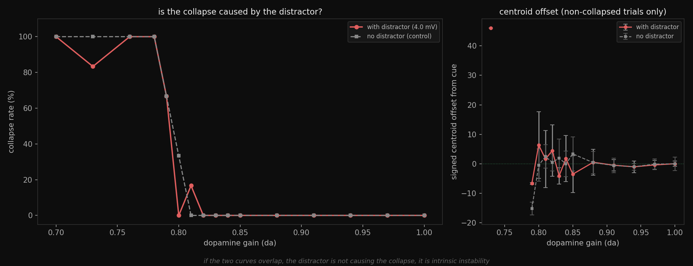
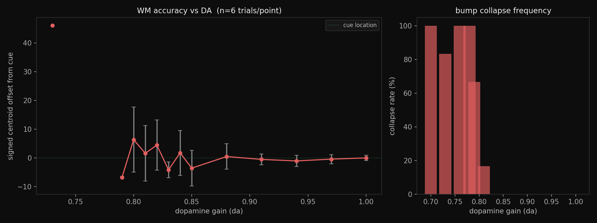
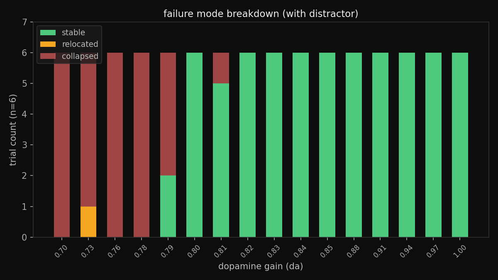
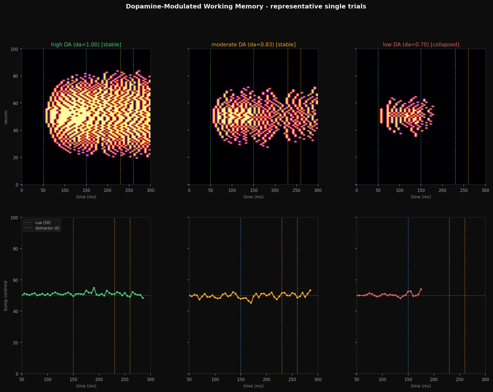
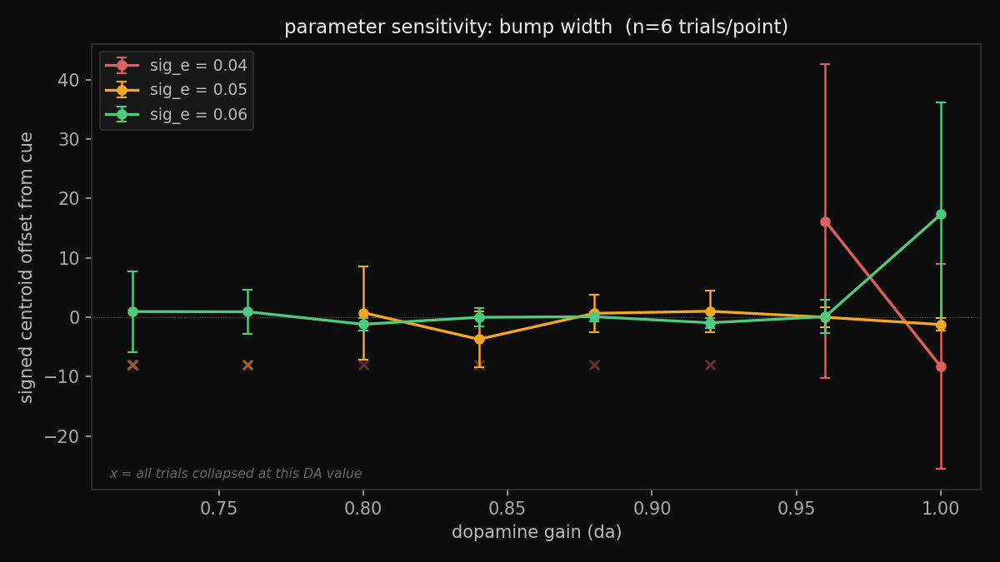

# Dopamine-Modulated Working Memory

A spiking network simulation testing how dopamine level affects whether a working memory bump persists during a delay period.

## Overview

Ring attractor networks model spatial working memory. Neurons sit on a ring with Mexican-hat connectivity: strong local excitation, weak global inhibition. A bump of activity persists without input, holding a location in memory.

The parameter `da` multiplies excitatory weights, mimicking D1 receptor gain modulation in prefrontal cortex. The code sweeps 16 DA levels (0.70 to 1.00, 6 trials each) with a no-distractor control to test whether collapse is caused by the distractor or by intrinsic instability.

Each trial is classified as:
- **stable**: bump survived near the cued location
- **relocated**: bump moved toward the distractor (rare)
- **collapsed**: bump died during the delay

## Protocol

```
0 ms:    baseline (50 ms)
50 ms:   cue ON (12 mV at position 50, 100 ms)
150 ms:  delay (80 ms, no input)
230 ms:  distractor ON (4 mV at position 0, 30 ms)
260 ms:  post-distractor (40 ms)
300 ms:  end
```

## Result

Below da ~ 0.79, bumps collapse even without a distractor. The no-distractor control shows identical collapse rates, so the collapse is intrinsic instability, not distractor-driven. Above da ~ 0.80, bumps persist and resist distractors. One trial at da=0.73 showed distractor-driven relocation (the bump shifted toward the distractor), but with only 1 out of 6 trials this is too thin to treat as a reliable effect.

## Figures

**The key figure**



Collapse rate and centroid offset plotted for the normal protocol vs. the no-distractor control, same seeds. The two curves sit on top of each other, which is what shows the collapse is intrinsic rather than caused by the distractor.

**DA threshold sweep**



Collapse rate and centroid offset across all 16 DA values, distractor condition only. Shows the transition sitting right around da=0.79-0.80.

**Failure mode breakdown**



Same sweep, broken into stable/relocated/collapsed trial counts per DA level instead of a single averaged number. Makes clear that "collapsed" and "relocated" are different failure modes, not one smeared-together outcome.

**Representative trials**



Three representative single trials (high, moderate, low DA), spike raster on top and bump centroid trace below. Gives a feel for what a stable vs. a collapsed trial actually looks like at the spike level.

**Parameter sensitivity**



Same DA sweep repeated at three bump widths (sig_e = 0.04, 0.05, 0.06) to check whether the sharp transition is specific to one width choice. `x` markers mark DA values where every trial collapsed at that width. Narrower bumps (0.04) collapse across most of the tested range and only survive near da=1.0, and even then the offset estimate is noisy.

## Full results table

<details>
<summary>Click to expand raw per-DA numbers (n=6 trials/point)</summary>

```
WITH DISTRACTOR
    DA   stable    reloc   collap   mean_off      sd    n   avg_spk
------------------------------------------------------------------------
  0.70        0        0        6       +nan     nan    0         0
  0.73        0        1        5      +46.0     0.0    1         3
  0.76        0        0        6       +nan     nan    0         0
  0.78        0        0        6       +nan     nan    0         0
  0.79        2        0        4       -6.7     0.3    2         6
  0.80        6        0        0       +6.4    11.3    6        57
  0.81        5        0        1       +1.6     9.7    5        75
  0.82        6        0        0       +4.5     8.7    6       104
  0.83        6        0        0       -4.1     2.8    6       117
  0.84        6        0        0       +1.8     7.8    6       128
  0.85        6        0        0       -3.5     6.2    6       142
  0.88        6        0        0       +0.5     4.4    6       173
  0.91        6        0        0       -0.5     1.9    6       211
  0.94        6        0        0       -1.0     2.0    6       260
  0.97        6        0        0       -0.4     1.6    6       296
  1.00        6        0        0       +0.0     0.9    6       340

WITHOUT DISTRACTOR (control)
    DA   stable    reloc   collap   mean_off      sd    n   avg_spk
------------------------------------------------------------------------
  0.70        0        0        6       +nan     nan    0         0
  0.73        0        0        6       +nan     nan    0         0
  0.76        0        0        6       +nan     nan    0         0
  0.78        0        0        6       +nan     nan    0         0
  0.79        2        0        4      -15.2     2.2    2        18
  0.80        4        0        2       -0.5     5.5    4        37
  0.81        6        0        0       +2.5     4.0    6        76
  0.82        6        0        0       +0.5     2.9    6       102
  0.83        6        0        0       +1.9     6.5    6       124
  0.84        6        0        0       -0.1     4.3    6       132
  0.85        6        0        0       +3.4     5.8    6       144
  0.88        6        0        0       +0.4     3.8    6       178
  0.91        6        0        0       -0.6     2.5    6       216
  0.94        6        0        0       -1.0     1.2    6       260
  0.97        6        0        0       -0.1     1.8    6       297
  1.00        6        0        0       -0.0     2.3    6       341
```

Columns: `stable`/`reloc`/`collap` are trial counts out of 6. `mean_off`/`sd` are the signed centroid offset from the cue, averaged over non-collapsed trials only (`n` = how many trials that average is based on). `avg_spk` is the mean late-window (250-300 ms) spike count across all 6 trials.

</details>

## Running

```bash
python ring_attractor_dopamine.py
```

Outputs (saved to `figures/`): `control_comparison.png`, `da_threshold_sweep.png`, `failure_mode_breakdown.png`, `ring_attractor_dopamine.png`, `parameter_sensitivity.png`

Runtime: ~4-6 minutes.

## Parameters

| Parameter | Value | Meaning |
|---|---|---|
| `J_e` | 7.0 mV | peak excitatory weight (tuned) |
| `J_i` | 0.2 mV | flat inhibitory offset |
| `sig_e` | 0.05 | gaussian half-width (fraction of ring) |
| `DIST_AMP` | 4.0 mV | distractor amplitude (0 for control) |

## Limitations

- LIF neurons, not Hodgkin-Huxley
- Single gain parameter (real D1 affects multiple conductances)
- No synaptic plasticity
- All-to-all connectivity with distance-dependent weights
- Tuned parameters, not experimentally measured

## References

- Compte, A., Brunel, N., Goldman-Rakic, P. S., & Wang, X.-J. (2000). Synaptic mechanisms and network dynamics underlying spatial working memory in a cortical network model. Cerebral Cortex, 10(9), 910–923. https://doi.org/10.1093/cercor/10.9.910
- Wang, X.-J. (2001). Synaptic reverberation underlying mnemonic persistent activity. Trends in Neurosciences, 24(8), 455–463. https://doi.org/10.1016/S0166-2236(00)01868-3
- Durstewitz, D., & Seamans, J. K. (2008). The dual-state theory of prefrontal cortex dopamine function with relevance to catechol-O-methyltransferase genotypes and schizophrenia. Biological Psychiatry, 64(9), 739–749. https://doi.org/10.1016/j.biopsych.2008.05.015
